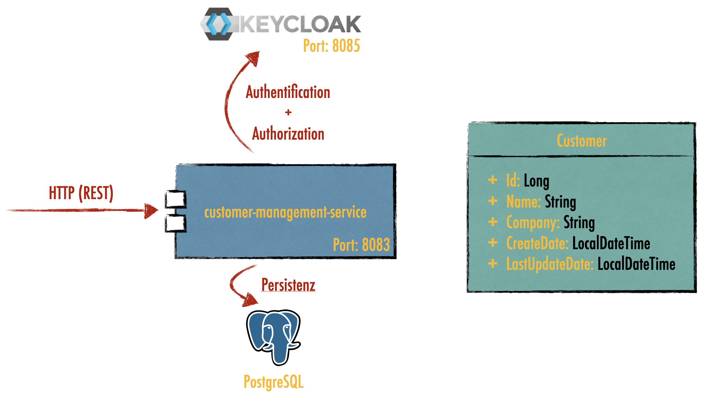

# customer-management-service

Dieses Projekt dient als Unterstützung für den [Workshop](https://github.com/FA-Team-SZUT/workshop-neusta-2021-06-21_und_22)
am 21.06. bzw. 22.06.2021.

Der Workshop setzt sich aus 7 Kapiteln ([Teil 2 bis 7](https://github.com/FA-Team-SZUT/workshop-neusta-2021-06-21_und_22)) zusammen. 
Jeder Teil wird zunächst einzeln vorgestellt und soll dann hier im Rahmen umgesetzt werden.

## Technische Voraussetzungen

* Java 11
* Maven 3.x 
* GIT
* Docker + Docker Compose

```sh 
$ java --version
openjdk 11.0.11 2021-04-20
OpenJDK Runtime Environment GraalVM CE 21.1.0 (build 11.0.11+8-jvmci-21.1-b05)
OpenJDK 64-Bit Server VM GraalVM CE 21.1.0 (build 11.0.11+8-jvmci-21.1-b05, mixed mode, sharing)

$ mvn --version
Maven home: /usr/local/Cellar/maven/3.8.1/libexec
Java version: 11.0.11, vendor: GraalVM Community, runtime: /Library/Java/JavaVirtualMachines/graalvm-ce-java11-21.1.0/Contents/Home
Default locale: de_DE, platform encoding: UTF-8
OS name: "mac os x", version: "11.4", arch: "x86_64", family: "mac"

$ git --version
git version 2.30.1 (Apple Git-130)

$ docker version
Client:
 Cloud integration: 1.0.17
 Version:           20.10.7
 ...
Server: Docker Engine - Community
 Engine:
  Version:          20.10.7
  ...
```

## Durchführung

1. Jedes Kapitel wird zunächst in dem Workshop einzeln vorgestellt
2. Jede:r Teilnehmer:in (oder eine Gruppe) entwickelt im eigenen Branch eine Lösung für das jeweilige Kapitel
3. Ein:e Teilnehmer:in (oder eine Gruppe) stellt eine Lösung vor
4. Ggf. wird die Musterlösung vorgestellt
5. Das nächste Kapitel wird vorgestellt

## Aufgabe



Erstelle die Anwendung `customer-management-service`. Ein Customer enthält dabei die 
Attribute `id`, `name`, `company`, `createDate` und `lastUpdateDate`.

Es muss möglich sein, über REST einen Customer anzulegen und zu löschen. Die Attribute
`name` und `company` sollen änderbar sein. Die Datumswerte werden automatisch bestimmt.

Die REST-Schnittstelle soll über einen [Keycloak](https://www.keycloak.org/) abgesichert sein.
Dieser stellt die Rolle `user` und einen Nutzer `szut` bereit.

Die Daten liegen persitent in einer [PostgreSQL](https://www.postgresql.org/).

Alle Komponenten (service, Keycloak und PostgreSQL) können über ein 
[Docker Compose](https://docs.docker.com/compose/) gestartet und gestoppt werden.

## Musterlösungen

Die Musterlösungen stehen jeweils als eigener Branch (`muster-loesung-kapitel-x`) bereit.

## Bauen und Testen

### Starten und Bauen der Anwendung

```sh 
# build it
$ git clone https://github.com/FA-Team-SZUT/customer-management-service
$ mvn clean package -P build-docker-images

# run it with spring boot
$ mvn spring-boot:run

# run it with plain java
$ java -jar target/customer*.jar

# run it with docker
$ docker run --rm -p 8083:8083 larmic/szut-customer-management-service 

# run it with docker compose
$ docker compose -f assets/docker/docker-compose.yml up
```

### Demo Requests

```sh 
# HTTP request examples
# Get all customers
$ curl -i -H "Accept: application/json" --request GET http://localhost:8083/

# Post a new customer
$ curl -i -H "Content-Type: application/json" --request POST --data '{"name":"Lars", "company":"szut"}}' http://localhost:8083/

# Read a specific customer     
$ curl -i -H "Accept: application/json" --request GET http://localhost:8083/{customer-id}   

# Update a specific customer    
$ curl -i -H "Content-Type: application/json" "Accept: application/json" --request PUT --data '{"name":"Lars", "company":"neusta"}}' http://localhost:8083/{customer-id}

# Delete a specific tweet
$ curl -i -H "Accept: application/json" --request DELETE http://localhost:8083/{customer-id} 
```